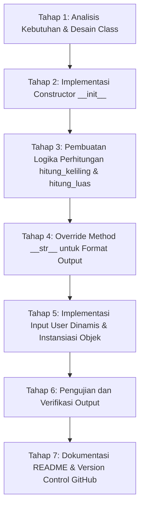

# 📐 Program Perhitungan Persegi Panjang (OOP Python)

Repositori ini berisi implementasi program berorientasi objek (*Object-Oriented Programming* / OOP) dalam bahasa Python untuk merepresentasikan dan menghitung parameter bentuk geometris **Persegi Panjang** (luas dan keliling).

---

## 📌 Deskripsi Program

Program ini dibuat menggunakan class `PersegiPanjang` yang mengenkapsulasi atribut `panjang` dan `lebar`, serta menyediakan metode-metode untuk menghitung keliling dan luas berdasarkan nilai input dinamis dari pengguna.

---

## 🔍 Penjelasan Tiap Sintaks & Fungsi (`def`)

Berikut adalah bedah sintaks secara lengkap dari file [`main.py`](file:///e:/SEMESTER%203/Pemrograman%20Multiplatform/Meet%204/CreateClass_0142/main.py):

```python
class PersegiPanjang:
    panjang = int
    lebar = int

    def __init__(self, panjang, lebar):
        self.panjang = panjang
        self.lebar = lebar

    def hitung_keliling(self):
        return (2 * self.panjang) + (2 * self.lebar)
    
    def hitung_luas(self):
        return self.panjang * self.lebar
    
    def __str__(self):
        return ("Keliling persegi panjang: " + str(self.hitung_keliling()) + "cm " + "\nLuas Persegi Panjang: " + str(self.hitung_luas()) + "cm")

panjang = int(input("Masukkan panjang: "))
lebar = int(input("Masukkan lebar: "))
kotak = PersegiPanjang(panjang, lebar)

print(kotak)
```

### 1. Deklarasi Class & Atribut
* `class PersegiPanjang:`
  * **Fungsi:** Mendefinisikan sebuah kelas bernama `PersegiPanjang`. Kelas ini berfungsi sebagai *blueprint* (cetak biru) untuk membuat objek persegi panjang.
* `panjang = int` & `lebar = int`
  * **Fungsi:** Deklarasi atribut tingkat kelas (*class attributes*) yang mendefinisikan bahwa properti panjang dan lebar diharapkan bertipe data bilangan bulat (*integer*).

---

### 2. Penjelasan Tiap Fungsi / Method (`def`)

#### 🔹 `def __init__(self, panjang, lebar):`
* **Peran:** Constructor / Inisialisasi Objek (*Dunder Method*).
* **Penjelasan:**
  * Method ini otomatis dieksekusi saat objek baru dibuat dari class `PersegiPanjang`.
  * Parameter `self` merujuk pada objek instans yang sedang dibuat.
  * Parameter `panjang` dan `lebar` adalah nilai awal yang dikirimkan saat pembuatan objek.
  * `self.panjang = panjang`: Menyimpan nilai parameter ke dalam atribut instans `self.panjang`.
  * `self.lebar = lebar`: Menyimpan nilai parameter ke dalam atribut instans `self.lebar`.

#### 🔹 `def hitung_keliling(self):`
* **Peran:** Method untuk Menghitung Keliling Persegi Panjang.
* **Penjelasan:**
  * Menghitung keliling menggunakan rumus matematika: $K = 2 \times p + 2 \times l$ (atau $2 \times (p + l)$).
  * Menggunakan `self.panjang` dan `self.lebar` milik objek terkait.
  * Sintaks `return (2 * self.panjang) + (2 * self.lebar)` mengembalikan nilai hasil perhitungan keliling ke pemanggil method.

#### 🔹 `def hitung_luas(self):`
* **Peran:** Method untuk Menghitung Luas Persegi Panjang.
* **Penjelasan:**
  * Menghitung luas persegi panjang menggunakan rumus: $L = p \times l$.
  * Sintaks `return self.panjang * self.lebar` mengembalikan nilai hasil perkalian panjang dan lebar.

#### 🔹 `def __str__(self):`
* **Peran:** String Representation (*Special / Magic Method*).
* **Penjelasan:**
  * Method ini menentukan apa yang akan ditampilkan ke layar saat objek dicetak langsung menggunakan fungsi `print(kotak)` atau diubah ke tipe string menggunakan `str(kotak)`.
  * Memanggil method `self.hitung_keliling()` dan `self.hitung_luas()`, mengonversinya menjadi teks dengan `str()`, lalu menggabungkannya dengan format rapi yang mencantumkan satuan `cm`.
  * Karakter `\n` digunakan untuk membuat baris baru (*newline*).

---

### 3. Eksekusi Program & Input Dinamis
* `panjang = int(input("Masukkan panjang: "))`
  * Mengambil input angka panjang dari user melalui terminal, kemudian dikonversi dari string menjadi bilangan bulat (`int`).
* `lebar = int(input("Masukkan lebar: "))`
  * Mengambil input angka lebar dari user melalui terminal dan mengonversinya ke integer.
* `kotak = PersegiPanjang(panjang, lebar)`
  * Proses **instansiasi** objek: membuat objek bernama `kotak` dari class `PersegiPanjang` dengan argumen `panjang` dan `lebar` yang telah diinput user.
* `print(kotak)`
  * Menampilkan informasi objek `kotak` ke terminal. Karena method `__str__` sudah didefinisikan, perintah ini langsung menampilkan format keliling dan luas secara rapi.

---

## 📊 Tabel Ringkasan Method (`def`)

| Nama Method | Parameter | Fungsi / Deskripsi | Nilai Kembalian (*Return*) |
| :--- | :--- | :--- | :--- |
| `__init__` | `self, panjang, lebar` | Menginisialisasi nilai panjang dan lebar saat objek diciptakan | Tidak ada (`None`) |
| `hitung_keliling` | `self` | Menghitung keliling persegi panjang ($2p + 2l$) | Bilangan bulat (*int*) |
| `hitung_luas` | `self` | Menghitung luas persegi panjang ($p \times l$) | Bilangan bulat (*int*) |
| `__str__` | `self` | Memformat representasi string dari objek untuk dicetak | *String* format rapi |

---

## 📈 Progress Kerja (Development Workflow)

Proses pengembangan program ini dilakukan dalam tahapan sistematis berikut:



- [x] **Tahap 1: Analisis Kebutuhan & Desain Class**
  - Mengidentifikasi atribut yang dibutuhkan (`panjang`, `lebar`) dan operasi matematika yang diperlukan (keliling dan luas).
- [x] **Tahap 2: Implementasi Constructor (`__init__`)**
  - Membuat method inisialisasi agar objek dapat menerima nilai panjang dan lebar secara fleksibel saat dibuat.
- [x] **Tahap 3: Pembuatan Logika Perhitungan**
  - Mengimplementasikan `hitung_keliling()` dengan rumus `(2 * p) + (2 * l)`.
  - Mengimplementasikan `hitung_luas()` dengan rumus `p * l`.
- [x] **Tahap 4: Override Method `__str__`**
  - Mengatur agar saat objek dipanggil dengan fungsi `print()`, langsung menghasilkan output teks yang rapi dan informatif beserta satuannya.
- [x] **Tahap 5: Implementasi Input Dinamis & Instansiasi**
  - Menambahkan baris input menggunakan `input()` dan konversi `int()`.
  - Membuat objek `kotak` dengan memasukkan input user.
- [x] **Tahap 6: Pengujian Program (Testing)**
  - Menjalankan program di terminal dan memvalidasi kebenaran hasil perhitungan keliling dan luas.
- [x] **Tahap 7: Dokumentasi & Git Synchronization**
  - Menyusun penjelasan kode dan progress kerja di `README.md`.
  - Melakukan commit dan push ke repositori GitHub.

---

## 💻 Contoh Penggunaan & Output

### Input di Terminal:
```text
Masukkan panjang: 10
Masukkan lebar: 5
```

### Output yang Dihasilkan:
```text
Keliling persegi panjang: 30cm 
Luas Persegi Panjang: 50cm
```

---

## 🚀 Cara Menjalankan Program

1. Buka terminal atau Command Prompt di direktori project.
2. Jalankan perintah berikut:
   ```bash
   python main.py
   ```
3. Masukkan angka panjang dan lebar saat diminta.